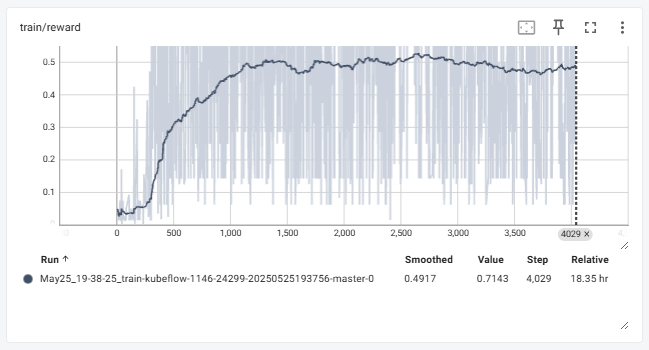

# MCTS-GRPO

GRPO is awesome, let’s put a tree on it! 🌲🌟

Exploration gets smarter when it follows the branches. 🌱

| Task         | Dataset       | Qwen2.5-7B-Instruct | MCTS-GRPO  |
|--------------|---------------|---------------------|------------|
| TableQA      | FEVEROUS      |                     |            |
|              | WikiTQ        | 27.85%              | 44.27%     |
|              | HybridQA      |                     |            |
| Math         | GSM8K         |                     |            |
|              | AIME          |                     |            |

