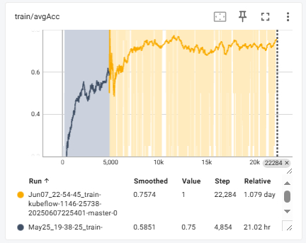

# MCTS-GRPO

GRPO is awesome, let’s put a tree on it! 🌲🌟

Exploration gets smarter when it follows the branches. 🌱


```sh
conda create --prefix /root/r1-engine python==3.11
conda activate /root/r1-engine

pip install "torch==2.5.1" tensorboard "setuptools<71.0.0"
pip install flash-attn

pip install  --upgrade \
  "transformers==4.48.1" \
  "datasets==3.1.0" \
  "accelerate==1.3.0" \
  "hf-transfer==0.1.9" \
  "deepspeed==0.15.3" \
  "trl==0.14.0" \
  "vllm==0.7.0"

pip install openpyxl
```





| Task         | Dataset       | Qwen2.5-7B-Instruct | MCTS-GRPO  |
|--------------|---------------|---------------------|------------|
| TableQA      | FEVEROUS      |                     |            |
|              | WikiTQ        | 27.85%              | 44.27%     |
|              | HybridQA      |                     |            |
| Math         | GSM8K         |                     |            |
|              | AIME          |                     |            |


