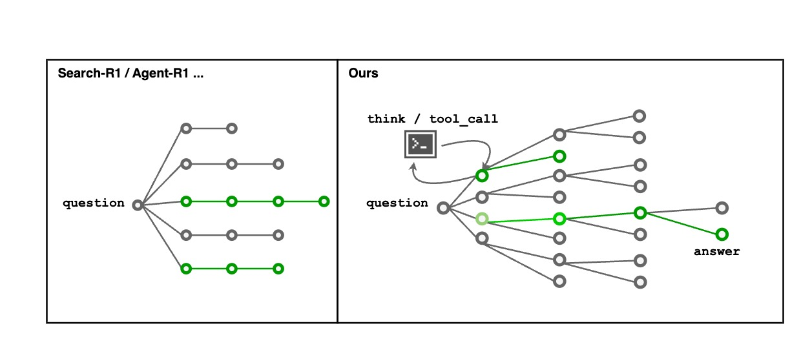

# MCTS * PO

## Policy Optimization is awesome, let’s put a tree on it! 🌲🌟 Exploration gets smarter when it follows the branches. 🌱





For a quick start, set up your environment through this:
```sh
conda create --prefix /root/r1-engine python==3.11
conda activate /root/r1-engine

pip install "torch==2.5.1" tensorboard "setuptools<71.0.0"
pip install flash-attn

pip install  --upgrade \
  "transformers==4.48.1" \
  "datasets==3.1.0" \
  "accelerate==1.3.0" \
  "hf-transfer==0.1.9" \
  "deepspeed==0.15.3" \
  "trl==0.14.0" \
  "vllm==0.7.0"

pip install openpyxl
```


| Task         | Dataset       | Qwen2.5-7B-Instruct | MCTS+GRPO  |
|--------------|---------------|---------------------|------------|
| TableQA      | FEVEROUS      |                     |            |
|              | WikiTQ        | 68.55%              | 75.62%     |
|              | HybridQA      |                     |            |
| Math         | GSM8K         |                     |            |
|              | AIME          |                     |            |


## Math Example
````markdown
# 💡 Prompt

> **Solve the following math problem step by step.**  
> You can *think* or *answer*.  
> Put your thinking in a `<think>…</think>` block and your answer in an `<answer>…</answer>` block.  
>   
> **Question.**  
> Let \(S\) be the solid in \(\mathbb{R}^3\) defined by
> \[
> \begin{aligned}
> &x \ge 0,\quad y \ge 0,\quad z \ge 0,\\
> &x+y+z<11,\\
> &2x+4y+3z \le 36,\\
> &2x+3z \le 24.
> \end{aligned}
> \]
> Determine the number \(v\) of vertices of \(S\).

---

## 🧠 Assistant Reasoning

<details>
<summary><strong>STEP&nbsp;1</strong></summary>

```html
<think>
Identify the bounding planes and note that each vertex occurs
where three plane boundaries intersect.  List the equalities:

① x + y + z = 11  
② 2x + 4y + 3z = 36  
③ 2x + 3z = 24  
④ x = 0 ⑤ y = 0 ⑥ z = 0

A vertex is any non-negative solution of three simultaneous equalities chosen
from the six.
</think>
````

</details>

<details>
<summary><strong>STEP&nbsp;2</strong></summary>

```html
<think>
Enumerate the triples of equalities, solve each system
(symbolically with Python/SymPy), and keep only the feasible,
distinct solutions.
</think>

<tool_call>
{
  "name": "execute_python_code",
  "arguments": {
    "code": "from sympy import symbols, Eq, solve\nx,y,z=symbols('x y z')\nplanes=[Eq(x+y+z,11),Eq(2*x+4*y+3*z,36),Eq(2*x+3*z,24),Eq(x,0),Eq(y,0),Eq(z,0)]\nverts=set()\nfrom itertools import combinations\nfor a,b,c in combinations(planes,3):\n    sol=solve((a,b,c),(x,y,z),dict=True)\n    if sol:\n        s=sol[0]\n        if all(v>=0 for v in s.values()):\n            verts.add(tuple(s[v] for v in (x,y,z)))\nprint(sorted(verts))\n"
  }
}
</tool_call>
```

</details>

<details>
<summary><strong>STEP&nbsp;3</strong></summary>

```html
<think>
The script returns the feasible vertices  
\((0,0,0),\;(3,5,3),\;(4,7,0),\;(6,0,0),\;(7,0,4),\;(9,2,0),\;(11,0,0)\).

There are **7 distinct vertices**, so \(v = 7\).
</think>

<answer>7</answer>
```

</details>

---

## ✅ Final Answer

$$
\boxed{7}
$$

> The solid $S$ is a convex polytope with seven vertices.

```
```


